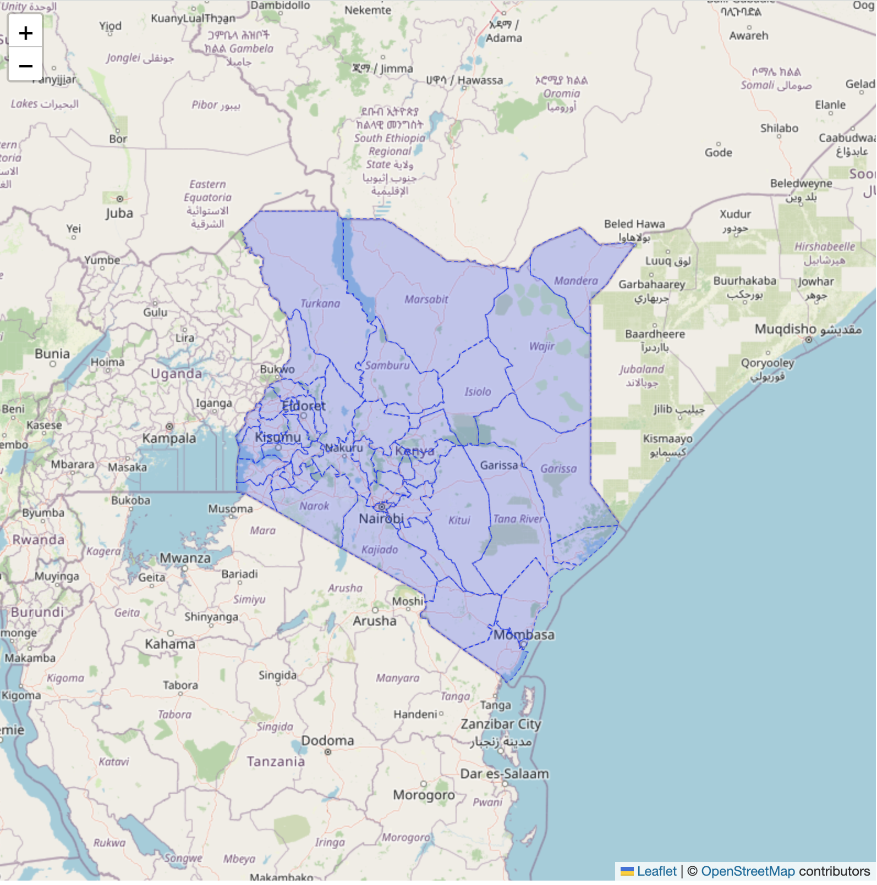

# Kenya Counties Map - React + Leaflet

A clean, reusable React component for rendering an interactive map of all 47 Kenyan counties with GeoJSON boundary data. Built with React, TypeScript, Leaflet, and Vite.



## Features

- **Interactive County Boundaries** - All 47 Kenyan counties rendered with accurate GeoJSON boundary data
- **Hover Effects** - County borders highlight when you hover over them
- **Click to Zoom** - Click any county to zoom and fit it within the map viewport
- **Responsive** - Built with React Leaflet for smooth interactions
- **Type-Safe** - Full TypeScript support

## Tech Stack

- **React 19** - UI library
- **TypeScript** - Type safety
- **Leaflet** - Interactive maps
- **React Leaflet** - React components for Leaflet
- **Vite** - Fast build tool
- **TailwindCSS** - Styling

## Getting Started

### Prerequisites

- Node.js (v18 or higher recommended)
- npm or yarn

### Installation

1. Clone the repository
```bash
git clone <your-repo-url>
cd kenyan-map-leaflet
```

2. Install dependencies
```bash
npm install
```

3. Run the development server
```bash
npm run dev
```

4. Open your browser to `http://localhost:5173`

## Usage

The main map component is in `src/App.tsx`. You can easily integrate it into your projects:

```typescript
import { MapContainer, TileLayer } from 'react-leaflet';
import { RenderCounties } from './RenderCounties';
import 'leaflet/dist/leaflet.css';

function App() {
  const handleCountyClick = (countyName: string) => {
    console.log('Clicked county:', countyName);
    // Add your custom logic here
  };

  return (
    <MapContainer
      center={[0.0236, 37.9062]} // Center of Kenya
      zoom={6.4}
      scrollWheelZoom={false}
    >
      <TileLayer
        attribution='&copy; OpenStreetMap contributors'
        url='https://{s}.tile.openstreetmap.org/{z}/{x}/{y}.png'
      />
      <RenderCounties runConsole={handleCountyClick} />
    </MapContainer>
  );
}
```

## Project Structure

```
src/
├── App.tsx              # Main application component
├── RenderCounties.tsx   # Component that renders all county GeoJSON layers
├── counties.ts          # Imports all county GeoJSON data
└── assets/              # GeoJSON files for all 47 counties
    ├── baringo.json
    ├── nairobi.json
    ├── mombasa.json
    └── ... (44 more counties)
```

## Customization

### Styling County Borders

Edit the `style` prop in `RenderCounties.tsx`:

```typescript
style={{
  weight: 2,           // Border thickness
  opacity: 0.5,        // Border opacity
  color: 'blue',       // Border color
  dashArray: '3',      // Dashed border
}}
```

### Hover Effects

Modify the `mouseover` and `mouseout` event handlers in `RenderCounties.tsx` to customize hover behavior.

### Map Center and Zoom

Adjust in `App.tsx`:
- `center={[latitude, longitude]}` - Change map center
- `zoom={6.4}` - Change initial zoom level
- `scrollWheelZoom={true}` - Enable scroll wheel zooming

## Available Scripts

- `npm run dev` - Start development server
- `npm run build` - Build for production
- `npm run preview` - Preview production build
- `npm run lint` - Run ESLint

## County Data

All 47 Kenyan counties are included with accurate GeoJSON boundary data in the `src/assets/` directory. The counties are:

Baringo, Bomet, Bungoma, Busia, Elgeyo-Marakwet, Embu, Garissa, Homa Bay, Isiolo, Kajiado, Kakamega, Kericho, Kiambu, Kilifi, Kirinyaga, Kisii, Kisumu, Kitui, Kwale, Laikipia, Lamu, Machakos, Makueni, Mandera, Marsabit, Meru, Migori, Mombasa, Murang'a, Nairobi, Nakuru, Nandi, Narok, Nyamira, Nyandarua, Nyeri, Samburu, Siaya, Taita-Taveta, Tana River, Tharaka-Nithi, Trans Nzoia, Turkana, Uasin Gishu, Vihiga, Wajir, West Pokot.

## Coming Soon

**Sub-Counties Support** - Detailed GeoJSON boundary data for all Kenyan sub-counties will be added in an upcoming release, enabling more granular map visualization and interactions.

## Future Enhancements

This is a clean base map that you can extend with:
- County information popups
- Data visualization (choropleth maps)
- Search functionality
- Custom markers and overlays
- Route planning
- Location-based features

## License

MIT

## Contributing

Contributions are welcome! Feel free to submit issues or pull requests.
